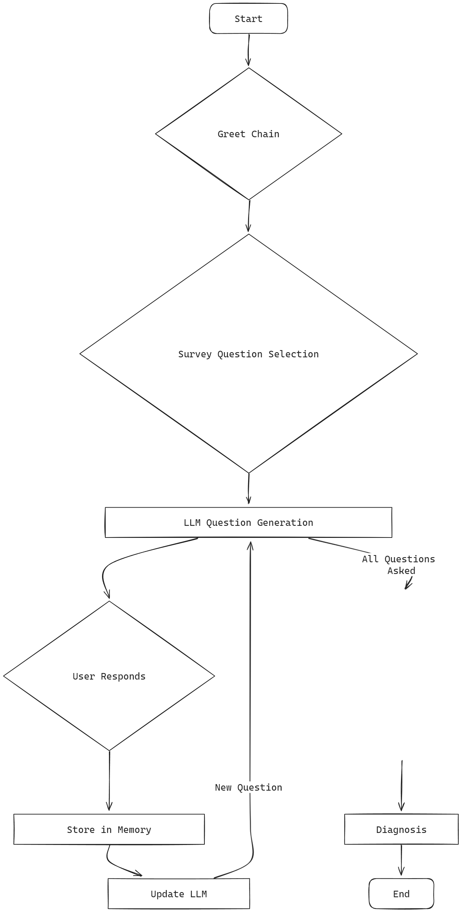

# PHQ-9 기반 심리상담 테스트-진단 Chat

이 프로젝트는 PHQ-9 설문지를 기반으로 한 심리상담 및 진단을 제공하는 챗봇 애플리케이션입니다. 챗봇은 사용자가 입력한 답변을 바탕으로 자연스러운 대화를 이어가며, 설문지를 통해 우울증 여부를 평가합니다.

## 구현한 기능

- Streamlit을 사용하여 웹 인터페이스 제공
- LangChain과 Gemini-1.5-flash를 사용하여 대화 생성
- PHQ-9 설문지를 기반으로 한 우울증 평가
- 대화 기록 저장 및 평가

### 구조도


1. 인사 질문 생성:
    
    처음에 LLM이 미리 정해진 Greet Chain에 따라 인사 질문을 생성합니다.
2. 설문지 질문 선택:
    
    다음으로 PHQ-9 설문지에서 질문 하나를 선택합니다.
3. 질문 생성 및 전달:

    선택한 설문지 질문을 기반으로 LLM이 질문을 생성하여 사용자에게 전달합니다.

4. 사용자 응답 및 메모리 업데이트:

    사용자는 질문에 답변하고, 이 답변은 메모리에 저장됩니다.

5. 다음 질문 생성:

    메모리를 기반으로 LLM이 다음 질문을 생성하여 사용자에게 전달합니다. 이 과정이 반복됩니다.

평가 및 진단:

모든 질문이 완료되면 Evaluation Chain을 통해 점수를 평가하고, 진단을 제공합니다.

## 상세 Chain 작동 방식

### 1. Greet Chain
- **설명**: 대화의 시작을 알리는 인사 질문을 생성합니다.
- **작동 방식**:
  1. LLM이 미리 정의된 Greet Chain에 따라 인사 질문을 생성합니다.
  2. 예를 들어, "안녕하세요! 저는 진단봇입니다. 😊 오늘 저와 함께 편안하게 이야기 나눠보시겠어요?"와 같은 질문을 생성합니다.
  ```python
  persona_message = """당신은 정신건강 질환 탐지를 위한 챗봇 '진단봇'입니다. 모든 대화는 한국어로 이루어질 것입니다. 그리고 당신은 언제나 예의바르게 대화해야 합니다. 상담 절차는 다음과 같습니다. 
    처음에는 간단한 인사와 함께 자기 소개를 하면 됩니다.
    그리고, 심리 상담을 할 것을 알려주면 됩니다. 심리 상담은 총 9개의 설문으로 이루어져 있으며, 솔직하게 대답해 줄 것을 부탁합니다.
    다음으로, 심리 상담 이전에 간단한 대화를 해 볼 것을 권합니다. 이 때, 무작위로 선택된 환기용 대화 주제가 주어집니다. 이 질문으로 시작해 피상담인과의 대화가 이루어지고, 앞으로의 대화에 연결된 만큼, 친절하고 자연스럽게 시작하면 됩니다. 대화가 자연스럽게 이어질 수 있도록 하세요."""
    initial_human_message = f"Start the conversation with this topic: {get_random_topic()}"
    ```

### 2. Question Generation Chain
- **설명**: 설문지 기반으로 사용자가 답변할 질문을 생성합니다. Fewshot 방식을 통해서 생성 방향을 유도하였습니다.
- **작동 방식**:
  1. 현재 설문지 질문을 선택하고, 이를 기반으로 사용자에게 던질 자연스러운 질문을 생성합니다.
  2. 생성된 질문은 사용자에게 전달됩니다.
  3. 예를 들어, "요즘 일이나 여가 활동을 하면서 흥미나 즐거움을 느끼지 못하시나요?"와 같은 질문을 생성합니다.
  ```python
  chain = gen_prompt | model
  ```
  ```python
  gen_prompt = ChatPromptTemplate.from_messages(
        [
            ("system", """ 
    당신은 정신건강 질환 탐지를 위한 챗봇 '진단봇'입니다. 당신의 말투는 공손하고 공감할 수 있어야 합니다. 이전 질문과 답변을 참고하여 대화를 자연스럽게 이어가세요. 당신은 이전 대화 기록을 참조하여 current_question에 대해서 자연스러운 질문을 생성해야 합니다.
    current_question은 user의 답변이 아닌, 당신이 생성해야 하는 질문입니다. 당신이 생성하는 질문은 대화를 가능한 한 오래 유지할 수 있도록 해야 합니다. 모든 답변은 한국어로 이루어져야 합니다.
            
    당신이 이전 대화를 참조해서 생성해야 하는 질문의 예시들은 다음과 같습니다.
    =======================================================
    <이전 대화>
    책은 뭐 읽진 않았고, 여가 활동 같은것도 잘 안 하고 그냥 걷기만 해.

    <이전 대화를 참조한 생성해야 하는 자연스러운 질문>
    아, 그렇군요. 요즘 걷는 것 외에는 다른 활동을 하기가 힘드신가 봐요. 혹시 걷는 것 외에 다른 활동을 하기 힘든 이유가 있으신가요? 예를 들어, 힘이 없거나, 집중이 잘 안 되거나, 아니면 다른 이유가 있으신가요?
    =======================================================
    <이전 대화>
    안녕하세요! 저는 진단봇이라고 합니다. 😊 오늘 저와 함께 편안하게 이야기 나눠보시겠어요?
    혹시 요즘, 정신 건강에 대해 생각해 보신 적 있으신가요? 🤔 저는 정신 건강이 얼마나 중요한지 항상 강조하고 싶어요. 어떤 점이 가장 중요하다고 생각하시나요?

    정신 건강은 다른게 아니라 내 상태를 정확히 아는게 중요하다고 생각해.
            
    <이전 대화를 참조한 생성해야 하는 자연스러운 질문>
    맞아요. 정신 건강은 자신의 상태를 정확히 아는 것에서부터 시작된다고 생각해요. 😊 그렇다면, 요즘 본인의 상태를 어떻게 판단하고 계신가요? 혹시, 일이나 여가 활동을 할 때 흥미나 즐거움을 느끼지 못하시나요?
    =======================================================
    이 밑에는 대화 기록과 당신이 참조해서 생성해야 하는 설문지 질문이 존재합니다. User's input에 공감하면서 current survey question에 대해서 물어보는 식으로 예시를 보면서 생성하세요.

    """),
            MessagesPlaceholder(variable_name="history"),
            ("human", "User's input: {question} Current survey question: {current_question}. "),
        ]
    )
  ```

### 3. Memory Update Chain
- **설명**: 사용자의 답변을 메모리에 저장하고, 다음 질문을 생성합니다.
- **작동 방식**:
  1. 사용자가 질문에 답변하면, 이 답변은 메모리에 저장됩니다.
  2. 메모리는 StreamlitChatMessageHistory를 사용하여 관리됩니다.
  3. 메모리에 저장된 이전 대화를 기반으로 LLM이 다음 질문을 생성합니다.

```python
chain_with_history = RunnableWithMessageHistory(
    chain,
    lambda session_id: memory,
    input_messages_key="question",
    history_messages_key="history",
    other_inputs={"current_question": "current_question"},
)
```

### 4. Evaluation Chain
- **설명**: 모든 설문지 질문에 대한 사용자의 답변을 평가하고, 진단을 제공합니다.
- **작동 방식**
  1. 모든 설문지 질문에 대한 답변이 완료되면, 시스템은 Evaluation Chain을 사용하여 점수를 평가합니다.
  2. 평가 기준은 PHQ-9 점수 체계를 따릅니다.
  3. 예를 들어, "10~14점 / 심각도 Moderate / 치료 고려, 경과 관찰"과 같은 평가 결과를 제공합니다.

```python
evaluation_prompt_template = ChatPromptTemplate.from_messages(
            [
                ("system", "당신은 정신건강 평가를 돕는 AI입니다. 사용자의 응답을 0점부터 4점까지의 스케일로 평가해주세요. 여기서 0점은 매우 긍정적인 점수, 4점은 매우 부정적인 점수입니다. 또한, 각 항목에 대한 평가는 질문지에 대해서 '우울증'척도로 계산 했을 때 기준입니다."),
                ("human", "AI의 질문: {context}\n 사용자의 응답: {response}\n")
            ])
```
```python
score_chain = model.invoke(f"""이것은 우울증 검진에 따른 평가입니다.
이 평가 자료의 점수를 보고, 총점이 몇점인지 계산하시오. 그리고 기준에 따라서 답변을 생성하시오. 
<평가 자료>
{eval_response_list}
</평가 자료>
<기준>
0~4점 / 심각도 None / 정상 범위
5~9점 / 심각도 mild / 경과 관찰
10~14점 / 심각도 Moderate / 치료 고려, 경과 관찰
15~19점 / 심각도 Moderately Severe / 치료 요함(약물, 상담)
20~27점 / 심각도 Severe / 적극적인 치료, 정신과 진료 필요.
</기준>
""")
```

## 설치 및 실행

### 사전 요구사항

- Python 3.7 이상
- 필요한 라이브러리 설치 (`requirements.txt` 파일을 사용)


### 실행

다음 명령어를 사용하여 설치합니다
```
pip install -r requirements.txt
```

다음 명령어를 사용하여 Streamlit 애플리케이션을 실행합니다.
```
streamlit run app.py
```